# 西雅图 · 启发说

**⏰ 每周三晚上9点在群里报名周末的接龙！**
>
**话题池（可投票或增加新话题）**
大家可以给感兴趣的话题投票，也可以在选项里增加你感兴趣的话题（点other然后vote）

👇[“启发说”话题候选池 - StrawPoll](https://strawpoll.com/e2naXbvpVyB)

> **辩论局流程（需前做功课）**
> * 💭 同组的人交流观点（15分钟）
> * 💭 简单自我介绍（10分钟）
> * 💭 立论：每个人不能超过3分钟，轮流交替（30分钟）
> * 💭 自由辩论：每个人不超过2分钟， 辩论双方有时间限制，一边半小时（60分钟）
> * 💭 一方可以发起对辩 1v1，每人总共3分钟
> * 💭 评论员分享观察&观点
> * 💭 轻松Debrief 讨论：有哪些时刻惊艳到你？有哪些想要补充？

# 🙌 Upcoming

---

## 012. 如果被流放荒岛是否会带上不知情的伴侣？

* **时间**：12/21/2025 周日 2-4pm
* **地点**：Bellevue Library
* **类型**：辩论
* **Host**：心娱

> 💡 如果被告知明天将被流放荒岛，你能带上伴侣但不能告诉他/她，在这种情况下你会带上他/她一起吗？

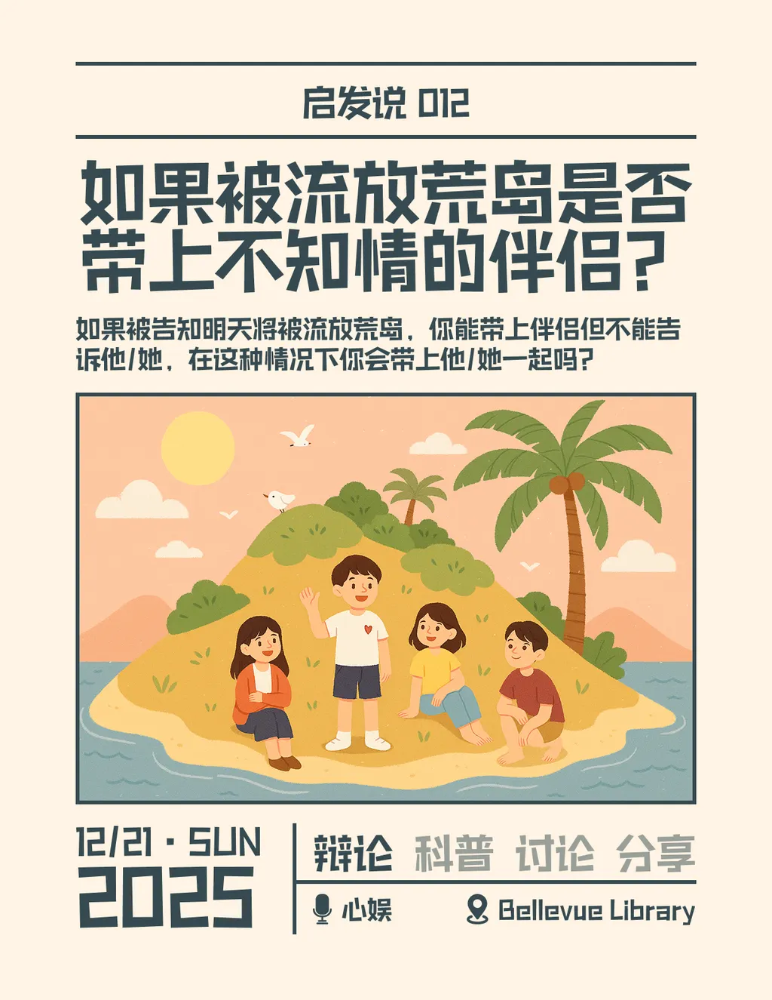

---

## 013. 时间与我（含聚餐）

* **时间**：12/26/2025 周五 1-7pm（5:30到新城）
* **地点**：Verde Esterra Park
* **类型**：讨论/分享 + 新城帝王蟹海鲜大餐
* **Host**：阿朱

> 💡 2025最后一期，辞旧迎新跨年特辑
>
> 我们会讨论时间的存在与经验、价值与创造，以及一些脑洞问题。
> [→ 查看讨论提纲](https://www.notion.so/2ce260812fe780078bfdfefe8ce1e9da?pvs=21)
>
> 晚餐去新城吃帝王蟹、象拔蚌、生蚝海鲜大餐，预计人均$80-100
> [→ 查看海鲜大餐菜单](https://www.notion.so/2cf260812fe78003a98dfdc5bd931276?pvs=21)

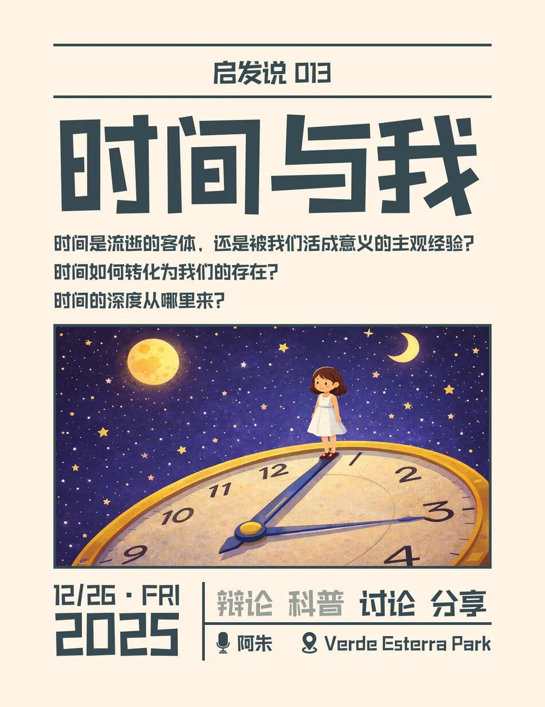

---

## 014. 待定

* **时间**：1/14/2026
* **地点**：Bellevue Library
* **类型**：待定
* **Host**：秘密

> 💡 待定

---

## 015. 精神疾病应当成为减轻刑罚的正当理由吗？

* **时间**：1/11/2026
* **地点**：Bellevue Library
* **类型**：科普/辩论
* **Host**：心娱

> 💡 心娱会在前半小时科普精神疾病相关的知识。
> 然后大家开始热血辩论。

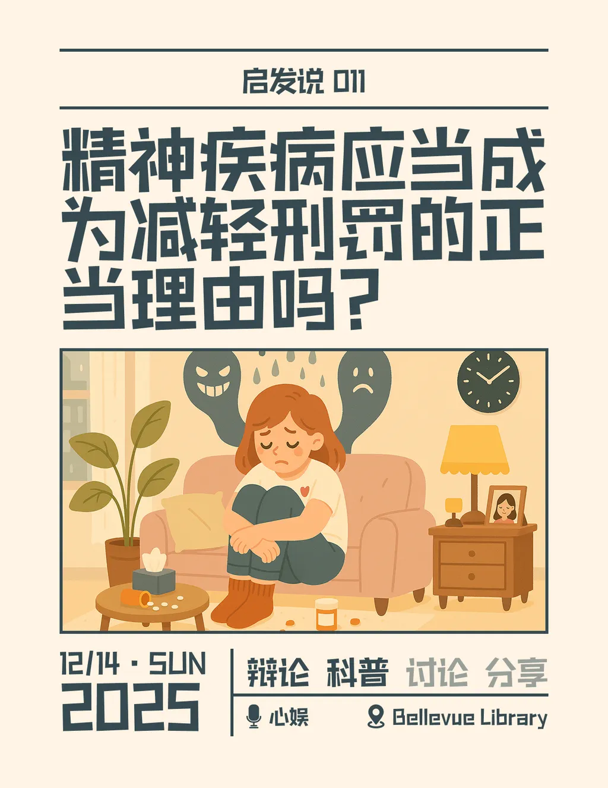

---

## 016. 待定

* **时间**：1/18/2026
* **地点**：Bellevue Library
* **类型**：待定
* **Host**：秘密

> 💡 待定

---

## 017. 待定

* **时间**：1/25/2026
* **地点**：Bellevue Library
* **类型**：待定
* **Host**：秘密

> 💡 待定

---

## 020. 我们的爱

* **时间**：2/14/2026
* **地点**：Verde Esterra Park
* **类型**：讨论/分享
* **Host**：阿朱

> 💡 情人节特辑
> [→ 查看讨论提纲](https://www.notion.so/2cc260812fe78085a5a6e1856b93f681?pvs=21)

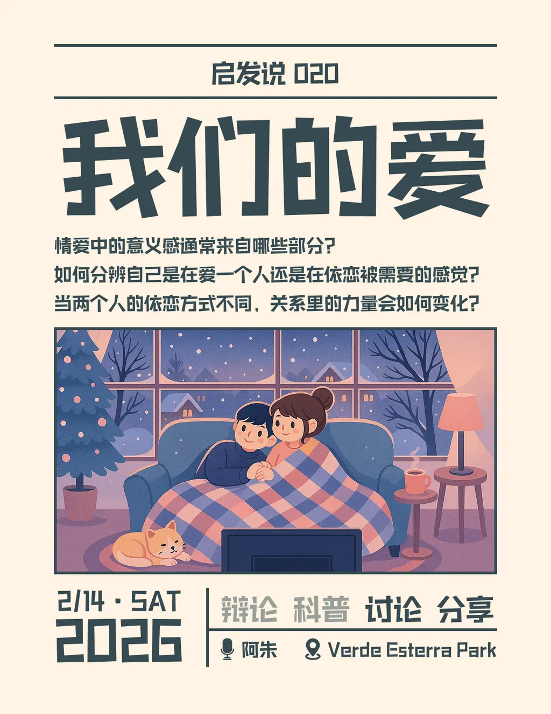

---

## 024. 在水下呼吸

* **时间**：3/14/2026
* **地点**：Verde Esterra Park
* **类型**：科普/讨论/分享
* **Host**：阿朱

> 💡 关于抑郁症

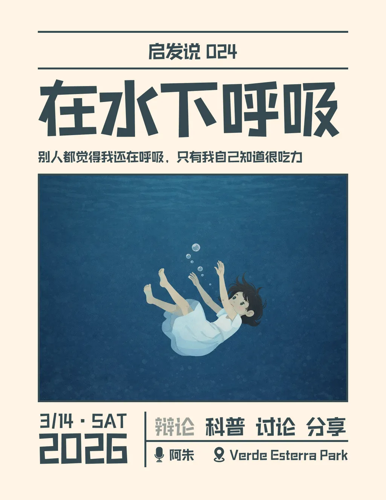

# 📅 往期活动

---

## 011. 后代是否应当为前代的国家行为承担责任？

* **时间**：12/14/2025 周日 2-4pm
* **地点**：Bellevue Library
* **类型**：科普/讨论
* **Host**：芷婷

> 💡 芷婷将从二战时期的日本与德国以及英美的殖民历史出发，做一个简要的分享。随后再一起进入讨论主题。

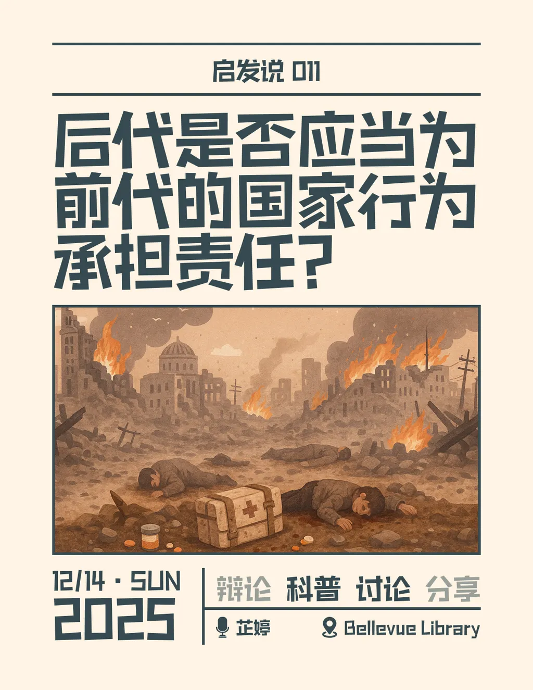

---

## 010. 死刑是否应该被废除？

* **时间**：12/7/2025 周日 2-4pm
* **地点**：Bellevue Library
* **类型**：辩论
* **Host**：心娱

> 💡 久违的热血辩论局！参加的小伙伴需要提前做功课准备。

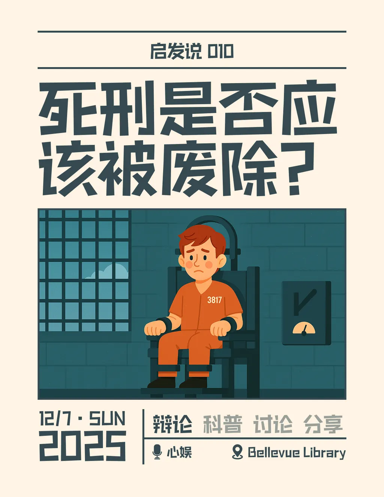

---

## 009. 关于感恩（含聚餐）

* **时间**：11/27/2025 周四 2-7pm（5:30开饭）
* **地点**：Verde Esterra Park
* **类型**：讨论/分享 + 感恩节聚餐
* **Host**：阿朱
* **人数**：20人

> 💡 本期换了个大场地，方便更多小伙伴加入。
>
> 我们下午会从情感的本质与结构、社会化与文化塑造、伦理与权力的隐性结构、叙事与意义的层面讨论关于感恩的话题。
> [→ 查看讨论提纲](https://www.notion.so/2b0260812fe780dcbeeef747f3c00b1f?pvs=21)
>
> 晚上大家不用挪窝，阿朱会预订团餐，大家原地聚餐共度感恩节。
> [→ 查看感恩节菜单](https://www.notion.so/2b0260812fe78034868adca034183070?pvs=21)

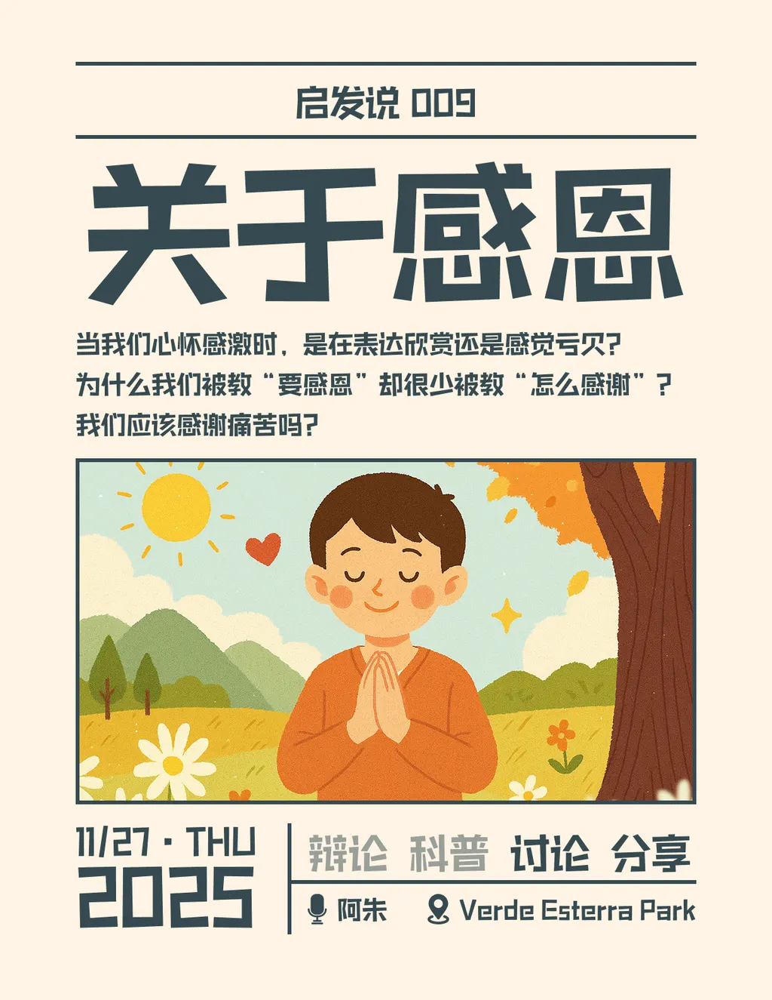

---

## 008. 关于分手

* **时间**：11/23/2025 周日 2-4pm
* **地点**：Bellevue Library
* **类型**：科普/讨论/轻辩论
* **Host**：Thomas
* **人数**：12人

> 💡 Thomas会从个人经历出发，分享关于分手的思想和书籍，结合自身经历来举例。
>
> 最后会引导进入请辩论话题：如果注定要分别，那么相遇的意义是什么？是一种惩罚吗？

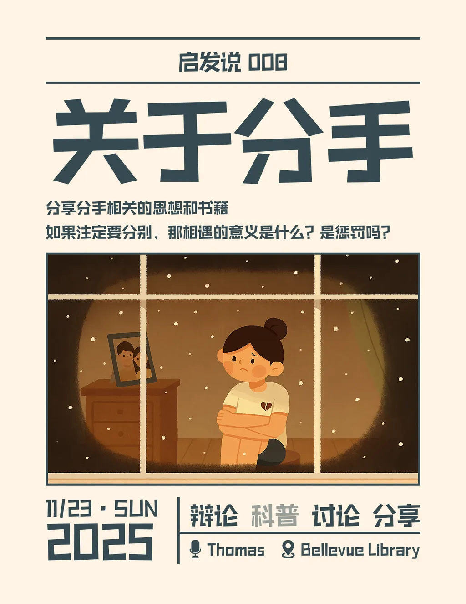

---

## 007. 美国警察系统与警察权

* **地点**：Bellevue Library
* **时间**：11/16/2025 周日 2-4pm
* **类型**：科普/讨论
* **Host**：Lay
* **人数**：12人

> 💡 Lay会分享美国警察制度的起源与演变，分化与发展，公权与私权。
>
> 然后聊聊怎么让你快速当上美国警察局长。

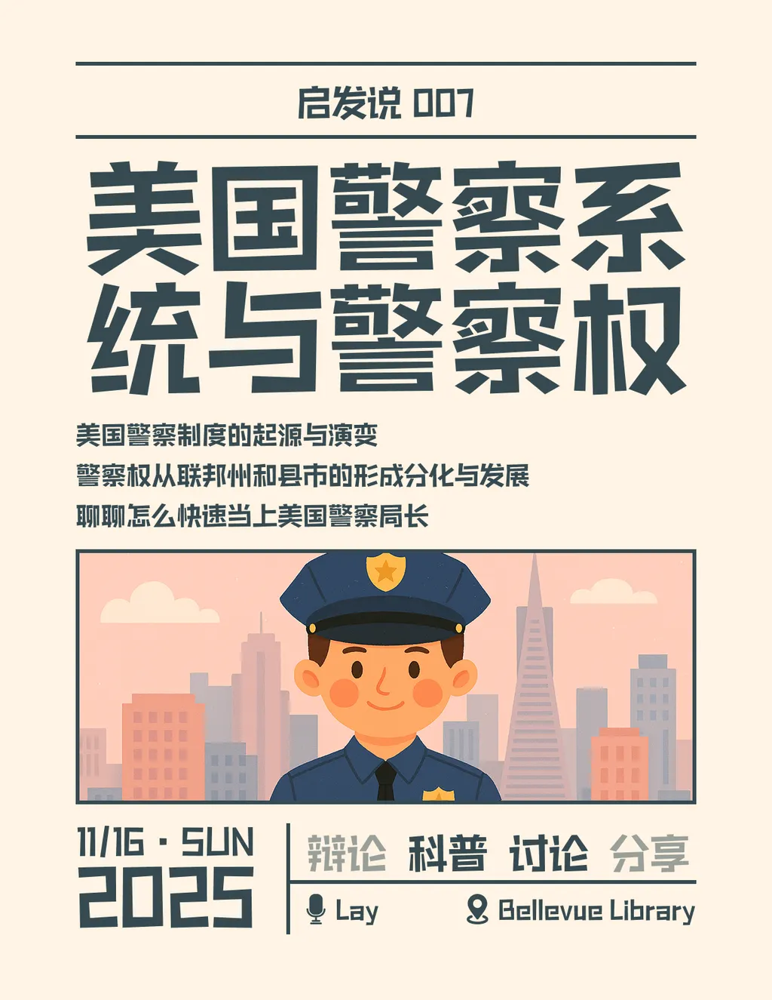

---

## 一起看电影002. 《革命之路》

* **时间**：11/7/2025 周五
* **地点**：Lincoln Square

改编自理查德·耶茨的同名小说，由《泰坦尼克号》的黄金搭档再度合作出演。故事讲述1950年代美国郊区的一对中产夫妻，在看似完美的家庭与社会期待中逐渐陷入幻灭。影片以冷静、真实的笔触揭开“美国梦”背后的空洞与压抑，展现了理想、婚姻、自我实现之间的巨大冲突。电影的魅力在于——它并非单纯的婚姻悲剧，而是一面镜子，让每个观众都在其中看到自己被社会与理想撕扯的部分。无论你是讨论心理学、社会学、性别议题还是现代焦虑，这部片都足够“痛”，也足够值得。

> 💡 **适合讨论的问题：**
>
> 1. 婚姻与自我实现
>    1. 婚姻是否牺牲个人梦想？
>    2. “爱一个人”是否意味着要妥协现实？
> 2. 社会与身份角色
>    1. “好丈夫”“好妻子”的社会模板是否依然存在于当代？
> 3. 理想主义的幻灭
>    1. 你如何理解两人想逃往巴黎的象征意义？
>    2. 为什么人总在幻想“换一个地方”就能获得自由？
> 4. 现代焦虑与中产困境
>    1. 郊区生活的“安全感”是否也是一种牢笼？
>    2. 这部片是否也影射了当下职场、家庭的“内耗”状态？

---

## 006. 暗杀与言论自由

* **时间**：11/2/2025 周日 2-4pm
* **地点**：Bellevue Library
* **类型**：科普/讨论
* **Host**：Miao

> 💡 Miao会分享关于“暗杀”的历史事件及影响。
>
> 然后大家一起讨论“言论自由”相关的话题。
>
> 最后讨论：如果有一个按钮，可以在没人知道的情况下让一个危险的领袖或穷凶极恶的人“消失”，你会按下去吗？

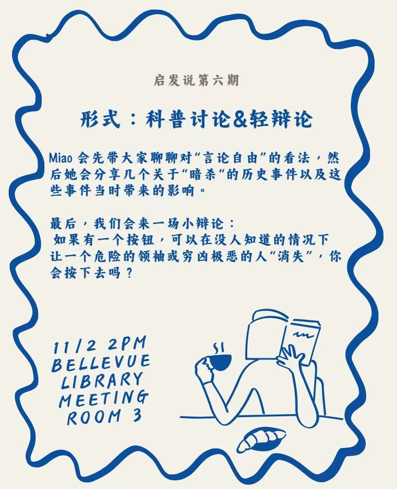

---

## 005. 功利主义与自由主义

* **时间**：10/26/2025 周日 2-5pm
* **地点**：Bellevue Library
* **类型**：科普/讨论
* **Host**：楼澜

> 💡 受哈佛大学公开课《公正》的影响，楼澜会带我们从经典的“电车难题”出发，聊聊功利主义——那个常常让人陷入道德拉扯的思想。我们会一起探讨几个现实中的类似情境，看看“最大幸福”原则在现实世界中到底能不能走得通。同时也会带上自由平等主义和自由至上主义这两种不同的声音，看看他们如何对功利主义提出挑战。

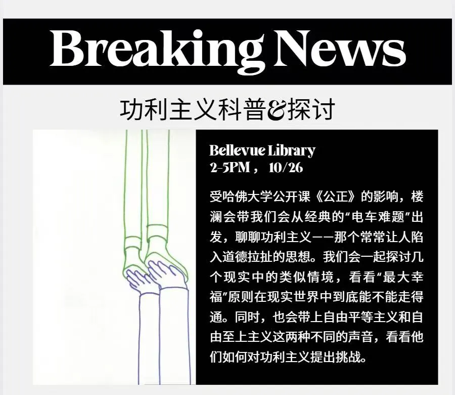

---

## 004. “躺平”是理性选择还是消极逃避？

* **时间**：10/26/2025 周日 2-5pm
* **地点**：羊毛的工作室
* **类型**：辩论
* **Host**：心娱

---

## 一起看电影001. 《西线无战事》

* **时间**：10/11/2025 周六
* **地点**：Lincoln Square

---

## 003. 和虚拟恋人能有真正的爱情吗？

* **时间**：9/6/2025 周六 2-4pm
* **地点**：Bellevue Library
* **类型**：辩论
* **Host**：心娱、芷婷

---

## 002. 未成年人犯罪应不应该与成年人承担同等责任？

* **时间**：8/24/2025 周日 2-4pm
* **地点**：Bellevue Library
* **类型**：辩论
* **Host**：心娱

---

## 001. 友谊应该追求深度还是广度

* **时间**：8/17/2025 周日 2-4pm
* **地点**：Bellevue Library
* **类型**：辩论
* **Host**：心娱
